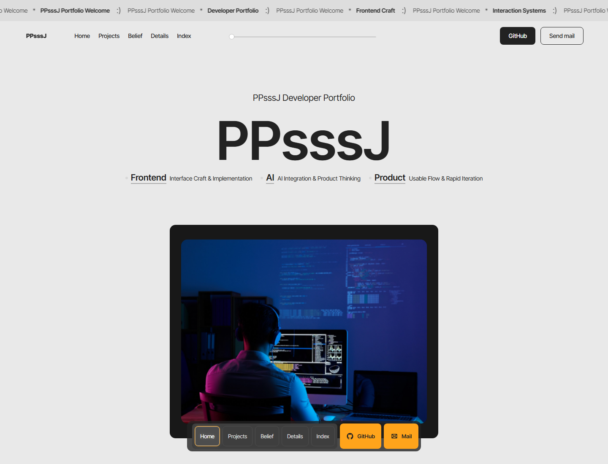

<p align="center">
  
</p>

# PPsssJ Developer Portfolio

Frontend developer portfolio built with React, TypeScript, and Vite.

## Live Site

https://ppsssj.vercel.app/

## Preview



## About

PPsssJ is a personal developer portfolio focused on frontend craft, interaction design, AI-driven product thinking, and polished project presentation. It includes selected projects, stack details, activity history, awards, and contact links.

## Tech Stack

- React
- TypeScript
- Vite
- Framer Motion
- CSS

## Featured Projects

- CodeGraph
- Cogic
- Git Effects
- GraphMind
- PrismDesign
- Traffic Noise Prediction System

## Run Locally

```bash
npm install
npm run dev
```

## Build

```bash
npm run build
```
